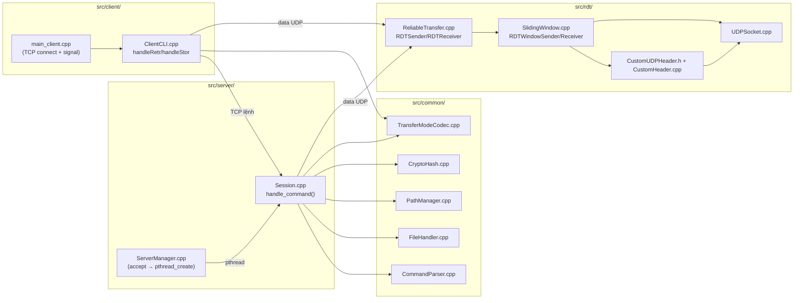

# KẾ HOẠCH CHUẨN BỊ VẤN ĐÁP & LIVE CODING — HYBRID FTP

> **Phạm vi:** Giai đoạn 4 (Ngày 11–12), theo `checklist_stage4.md` và rubric trong `Project1_SocketProgramming_2026.docx`
> **Trọng số điểm:** Vấn đáp lý thuyết **30%** + Live Coding **20%** + Code & Demo **40%** + Tài liệu/GenAI **10%**
> **Chính sách 0 điểm:** Bị hỏi đúng module được giao trong Task Assignment Matrix mà **không giải thích được** → điểm 0 cho 2 tiêu chí lý thuyết + live coding. Ai cũng phải hiểu được **toàn bộ hệ thống**, nhưng module riêng của mình phải "nắm chắc từng dòng code".

---

## 0. Tổng quan kiến trúc chung (MỌI THÀNH VIÊN phải nắm)

Đây là phần **ai cũng bị hỏi** (dù hỏi module riêng của ai, giám khảo vẫn trộn câu hỏi chung hệ thống).

### 0.1 Mô hình Hybrid: TCP Control + UDP Data

| Kênh                     | Giao thức         | Trách nhiệm                                  | Tại sao tách rời                                          |
| :------------------------ | :----------------- | :--------------------------------------------- | :----------------------------------------------------------- |
| **Control Channel** | TCP (`:2121`)    | Lệnh FTP, reply 1xx–5xx, trạng thái phiên | TCP connection-oriented, tin cậy, đảm bảo thứ tự lệnh |
| **Data Channel**    | UDP + RDT tự chế | Payload file/danh sách thư mục              | UDP nhanh, không bảo đảm gì → tự viết tầng tin cậy |

**Câu hỏi kinh điển:** *"Tại sao không dùng TCP cho cả 2 kênh?"*
→ Nếu data cũng dùng TCP thì mất ý nghĩa "hybrid"; UDP + RDT cho phép tự điều khiển cửa sổ (cwnd), kiểm soát tắc nghẽn, tận dụng băng thông; đồng thời thể hiện được hiểu biết sâu về giao thức (yêu cầu mức Excellent).

### 0.2 Vòng đời kết nối tổng quát

```
Client (TCP connect) → 220 Service ready → USER → 331 → PASS → 230 Login
→ [lặp lệnh: PASV → 227, RETR/STOR/LIST → 150 → RDT trên UDP → 226]
→ QUIT → 221 → đóng TCP
```

- Mỗi client = 1 `pthread` + 1 `SessionState` riêng (Thread-per-Client).
- Kênh data UDP được mở **một lần cho một transfer** (single-use trong PASV), hoặc socket tạm mỗi transfer (ACTIVE).

### 0.3 Bảng mã phản hồi (Dev nào cũng phải nhớ)

| Nhóm | Ý nghĩa                      | Ví dụ trong project                                         |
| :---- | :----------------------------- | :------------------------------------------------------------ |
| 1xx   | Preliminary (sắp thực hiện) | `150 Opening data connection`                               |
| 2xx   | Completion (thành công)      | `200`, `220`, `221`, `226`, `230`, `250`, `257` |
| 3xx   | Intermediate (chờ tiếp)      | `331 Need password`, `350 Pending RNTO`                   |
| 4xx   | Transient (lỗi tạm thời)    | `425 Can't open data connection`, `426 Transfer aborted`  |
| 5xx   | Permanent (lỗi vĩnh viễn)   | `500`, `501`, `502`, `530`, `550`, `551`          |

> Vị trí code: `send_reply()` tại `src/server/Session.cpp:106`.

### 0.4 Câu hỏi chung nhóm (chuẩn bị sẵn câu trả lời)

1. Giải thích socket workflow của project (socket → bind → listen → accept → recv/send).
2. Sự khác biệt TCP vs UDP, tại sao tách control/data.
3. Trình bày 1 vòng RETR đầy đủ từ lúc client nhập lệnh tới lúc file về máy.
4. Kể tên các lệnh đã hỗ trợ (xem HELP) và mã trả về tương ứng.
5. Kích thước custom header là bao nhiêu byte? (→ 15 byte, giải thích từng field).

---

## 0.5 Giải thích đồ án: nhiệm vụ chi tiết của từng file trong `src/`

> **Ghi chú quan trọng:** Khi bảo vệ, giám khảo có thể mở **bất kỳ file nào** và hỏi "file này làm gì?" hoặc "ai chịu trách nhiệm?". Đây là bảng giải thích **toàn bộ thư mục `src/`** theo đúng code thực tế. Cấu trúc gồm 4 folder: `server`, `client`, `rdt`, `common`. Build được ghép qua `CMakeLists.txt` (3 target chính: `ftp_server`, `ftp_client`, `rdt_file_server/rdt_file_client`).

```structure
src/
├── server/    # Phần FTP SERVER (điều phối control + data channel)
├── client/    # Phần FTP CLIENT (CLI + truyền file)
├── rdt/       # Tầng Reliable Data Transfer tự viết trên UDP (core Dev 2)
└── common/    # Tiện ích dùng chung giữa server & client (parser, file, path, hash)
```

### 0.5.1 `src/server/` — FTP Server (TCP control + mở data channel)

| File                            | Nhiệm vụ chi tiết                                                                                                                                                                                                                                                                                                                                                                                                                                                                                                                                            | Người chính                                           |
| :------------------------------ | :-------------------------------------------------------------------------------------------------------------------------------------------------------------------------------------------------------------------------------------------------------------------------------------------------------------------------------------------------------------------------------------------------------------------------------------------------------------------------------------------------------------------------------------------------------------- | :------------------------------------------------------- |
| **`main_server.cpp`**   | Entry point server. Nhận port từ`argv` (mặc định `2121`), gọi `server_init()` → `server_run()`. Đăng ký xử lý `SIGINT` gọi `server_stop()` để tắt sạch listener.                                                                                                                                                                                                                                                                                                                                                                   | Dev 1                                                    |
| **`ServerManager.h`**   | Định nghĩa`ClientRecord {socketFd, ip, port, active}` và `ServerState {listenFd, port, running, clientsLock, clients[100]}`. Hằng `MAX_CLIENTS = 100`.                                                                                                                                                                                                                                                                                                                                                                                               | Dev 3                                                    |
| **`ServerManager.cpp`** | Vòng đời server:`server_init()` (socket→bind→listen, `SO_REUSEADDR`); `server_run()` (vòng lặp `accept()`, in IP client, `clients_add()`, malloc `SessionArgs`, `pthread_create` + `pthread_detach` gọi `handle_client_thread`); `clients_add()/clients_remove()` (thêm/xóa phiên dưới `clientsLock`); `clients_print()` (in bảng active session — dùng cho demo Case 4).                                                                                                                                               | Dev 3                                                    |
| **`Session.h`**         | Định nghĩa`SessionState` (loginState, username, transferType A/I, transferMode S/B/C, pathManager, renameFrom, dataMode, activeIP/activePort, passiveSocket) và `SessionArgs`. `handle_client_thread()` dùng chung.                                                                                                                                                                                                                                                                                                                                  | Dev 1 + Dev 3                                            |
| **`Session.cpp`**       | **Trái tim của server**: `read_line()` đọc lệnh từng ký tự qua TCP; `send_all()`/`send_reply()` gửi reply; `consume_pending_abor()` dùng `MSG_PEEK` để bắt ABOR giữa transfer; `handle_command()` xử lý **toàn bộ lệnh FTP** (USER, PASS, QUIT, NOOP, TYPE, MODE, PORT, PASV, PWD, CWD, CDUP, MKD, RMD, LIST, NLST, STAT, SIZE, MDTM, DELE, RNFR, RNTO, RETR, STOR, STOU, APPE, HASH, ABOR, HELP); lambda `open_data_channel()` mở UDP theo ACTIVE/PASSIVE; `handle_client_thread()` chạy vòng đời session. | Dev 1 (control) + Dev 3 (data channel, HASH, STOU, APPE) |

### 0.5.2 `src/client/` — FTP Client (CLI)

| File                          | Nhiệm vụ chi tiết                                                                                                                                                                                                                                                                                                                                                                                                           | Người chính |
| :---------------------------- | :----------------------------------------------------------------------------------------------------------------------------------------------------------------------------------------------------------------------------------------------------------------------------------------------------------------------------------------------------------------------------------------------------------------------------- | :------------- |
| **`main_client.cpp`** | Entry point client. Parse host/port (mặc định`127.0.0.1:2121`), `connectToServer()` mở TCP, đọc banner `220`, tạo `ClientCLI` với lambda gửi lệnh `\r\n` + `recvReply()` (hỗ trợ reply multi-line `XYZ-`). Đăng ký `SIGINT`/`SIGTERM` → `notifyAbort()` để gửi ABOR + QUIT sạch.                                                                                                       | Dev 3          |
| **`ClientCLI.h`**     | Khai báo`ClientCLI`: giữ `m_controlSock`, `m_serverHost`, `m_transferType`, `m_transferMode`, cờ `m_aborted`. `CommandSender` là hàm callback gửi lệnh.                                                                                                                                                                                                                                                   | Dev 3          |
| **`ClientCLI.cpp`**   | Vòng lặp REPL`ftp> `. `handleRetr()` (PASV → parse 227 → mở UDP → knock 15 byte → gửi RETR → nhận 150 → `RDTReceiver::receiveBuffer` → ghi file → tự tính SHA-256 → đọc 226); `handleStor()` (đọc file → hash trước → PASV → STOR/STOU/APPE → `RDTSender::sendBuffer` → in thống kê cwnd/timeouts/segs → 226); `handleList()` cho LIST/NLST qua UDP. Hỗ trợ alias `GET`/`PUT`. | Dev 3          |

### 0.5.3 `src/rdt/` — Tầng RDT tự viết trên UDP (quan trọng nhất để lấy điểm Excellent)

| File                                  | Nhiệm vụ chi tiết                                                                                                                                                                                                                                                                                                                                                                                                                                                                                                                                                                                                                                                                | Người chính         |
| :------------------------------------ | :---------------------------------------------------------------------------------------------------------------------------------------------------------------------------------------------------------------------------------------------------------------------------------------------------------------------------------------------------------------------------------------------------------------------------------------------------------------------------------------------------------------------------------------------------------------------------------------------------------------------------------------------------------------------------------- | :--------------------- |
| **`CustomUDPHeader.h`**       | Định nghĩa header 15 byte (`#pragma pack(1)`): `seqNum(4) + ackNum(4) + payloadLen(2) + windowSize(2) + checksum(2) + flags(1)`. Enum flags: `FLAG_SYN=1, FLAG_ACK=2, FLAG_DATA=4, FLAG_FIN=8, FLAG_NAK=16`. Hàm `setFlag/clearFlag/hasFlag`, khai báo `calculateChecksum/verifyChecksum/serializeHeader/deserializeHeader`.                                                                                                                                                                                                                                                                                                                                         | Dev 2                  |
| **`CustomHeader.cpp`**        | Triển khai checksum & endianness:`internetChecksum()` (cộng 16-bit word của [header với checksum=0] + [payload], xử lý carry); `calculateChecksum()` đặt `checksum=0` trước khi tính; `serializeHeader()/deserializeHeader()` dùng `htonl/htons` ↔ `ntohl/ntohs` để tương thích giữa 2 máy khác kiến trúc.                                                                                                                                                                                                                                                                                                                                       | Dev 2                  |
| **`UDPSocket.h/.cpp`**        | Lớp bọc socket UDP gửi/nhận gói thô:`open()`, `bind(port)` (0 = ephemeral), `sendTo()`, `recvFrom()` (trả ra IP/port nguồn), `setRecvTimeout()`, `getLocalPort()`, `close()`. Không copy (socket là tài nguyên hệ điều hành). Dùng chung cho cả client & server.                                                                                                                                                                                                                                                                                                                                                                                    | Dev 2                  |
| **`SlidingWindow.h`**         | Khai báo`RDTWindowSender` (config: `mss=1024`, `initCwnd=1.0`, `initSsthresh=8.0`, `maxWindowSegments=32`, `timeout=500ms`, `maxRetransmitRounds=16`; API `sendData()`, thống kê `getFinalCwnd/getTotalTimeouts/getTotalPacketsSent`) và `RDTWindowReceiver` (nhận tới FIN, `expectedSeq`, `sendCumulativeAck`, `advertisedWindow=8`). Header chú thích đầy đủ ý tưởng GBN + Flow/Congestion Control.                                                                                                                                                                                                                                      | Dev 2                  |
| **`SlidingWindow.cpp`**       | **Lõi thuật toán**: `sendSegment()/sendFIN()` đóng gói gói tin; `computeEffectiveWindow() = min(cwnd, recvWindow, maxWindowSegments)`; `sendData()` chia file thành segment, pipeline GBN với vòng lặp `base/nextSeq`, xử lý timeout → `ssthresh=cwnd/2, cwnd=1, nextSeq=base` (Go-Back-N), cập nhật cwnd Slow Start (`+1`) hay Congestion Avoidance (`+1/cwnd`) theo ACK, nhận `windowSize` trong ACK để cập nhật `recvWindow_` (flow control), kết thúc gửi FIN chờ FINACK; `receiveData()` nhận gói đúng thứ tự `expectedSeq`, checksum sai hoặc seq lệch → gửi lại cumulative ACK cũ, gặp FIN → trả FINACK. | Dev 2                  |
| **`ReliableTransfer.h/.cpp`** | Lớp bọc cho Dev 3/Session:`RDTSender` (`sendFile`, `sendBuffer` dùng `RDTWindowSender`; `sendPacket` Stop-and-Wait backward-compat; getters thống kê `getFinalCwnd/getTotalTimeouts/getTotalSegsSent/getRetryCount`; setters forward config) và `RDTReceiver` (`receiveBuffer`, `receiveFile` dùng `RDTWindowReceiver`; `receivePacket` backward-compat).                                                                                                                                                                                                                                                                                              | Dev 2 (hỗ trợ Dev 3) |
| **`FileTransferClient.cpp`**  | Chương trình nghiệm thu độc lập`rdt_file_client`: đọc file, `RDTWindowSender` gửi với tham số MSS/cwnd/ssthresh/maxWin truyền vào, in throughput (KB/s), cwnd cuối, số timeout, số segment, SimpleSum để đối chiếu. Là 1 trong 2 nguồn kết quả của `test_rdt.sh`.                                                                                                                                                                                                                                                                                                                                                                                  | Dev 2                  |
| **`FileTransferServer.cpp`**  | Chương trình nghiệm thu độc lập`rdt_file_server`: bind port, `RDTWindowReceiver` nhận với `advWindow` truyền vào, ghi `output_file`, in SimpleSum để so sánh với sender. Kết hợp với FileTransferClient để chứng minh GBN + Flow Control + Congestion Control.                                                                                                                                                                                                                                                                                                                                                                                         | Dev 2                  |

### 0.5.4 `src/common/` — Tiện ích dùng chung

| File                                   | Nhiệm vụ chi tiết                                                                                                                                                                                                                                                                                                                                                                                                                                                                                                                                                                                               | Người chính      |
| :------------------------------------- | :----------------------------------------------------------------------------------------------------------------------------------------------------------------------------------------------------------------------------------------------------------------------------------------------------------------------------------------------------------------------------------------------------------------------------------------------------------------------------------------------------------------------------------------------------------------------------------------------------------------- | :------------------ |
| **`CommandParser.h/.cpp`**     | Phân tích cú pháp lệnh FTP:`parse()` trim `\r\n`/khoảng trắng, tách `name` (chữ hoa) và `argument` tại khoảng trắng đầu tiên, trả `ParsedCommand {name, argument, valid}`. VD: `"CWD documents\r\n"` → `name="CWD", argument="documents"`.                                                                                                                                                                                                                                                                                                                                         | Dev 1               |
| **`FileHandler.h/.cpp`**       | I/O file an toàn:`readBinaryFile/writeBinaryFile` (dùng `std::ios::binary`, `writeBinaryFile` có `append` → `std::ios::app` cho APPE), `readTextFile/writeTextFile` (ASCII), `fileExists`, `getFileSize` (dùng `stat`).                                                                                                                                                                                                                                                                                                                                                                     | Dev 3               |
| **`PathManager.h/.cpp`**       | **Bảo mật đường dẫn (sandbox)**: gốc mặc định `server_storage`. `resolvePath()` (path tuyệt đối ép về gốc, path tương đối nối vào thư mục hiện tại); `isInsideRoot()`/`isPathInsideRoot()` (so sánh từng phần tử path với root → chống `../../`); `changeDirectory/changeToParentDirectory`; `listDirectory/listNames` (định dạng `name, type, size, permissions`); `getStatus/getFileSize/getModificationTime`; `deleteFile/canRename/renamePath`; `createDirectory/removeDirectory`; `generateUniqueFilename()` (thêm `_1, _2…` cho STOU). | Dev 3               |
| **`CryptoHash.h/.cpp`**        | Tính SHA-256 bằng OpenSSL:`computeSHA256(vector<char>)` và `computeSHA256FromFile(filepath)` (đọc file qua `FileHandler::readBinaryFile` rồi băm). Dùng cho lệnh `HASH`, log sau RETR/STOR, và client tự xác minh toàn vẹn.                                                                                                                                                                                                                                                                                                                                                                  | Dev 3               |
| **`TransferModeCodec.h/.cpp`** | Mã hóa/giải mã dữ liệu theo`TransferMode {Stream, Block, Compressed}`: `encode()` chuyển buffer theo mode trước khi gửi, `decode()` (trả `false` nếu stream MODE B/C hỏng) trả dữ liệu gốc theo `TransferType {ASCII, Binary}`. Đảm bảo cả 2 đầu client/server dùng chung cách biểu diễn.                                                                                                                                                                                                                                                                                     | Dev 1/Dev 2 (chung) |

### 0.5.5 Bản đồ luồng dữ liệu (ai gọi ai) — dùng để trả lời "file này liên quan file kia thế nào"



> **Mẹo trả lời khi bị hỏi:** "File X nằm ở tầng nào, gọi tới ai?" → chỉ theo mũi tên trên: `Session/ClientCLI` (tầng ứng dụng FTP) → `ReliableTransfer` (tầng RDT wrapper) → `SlidingWindow` (thuật toán GBN/flow/congestion) → `UDPSocket + CustomUDPHeader` (raw socket & định dạng gói). `common/*` là tiện ích dùng chung ở cả 2 phía.

---

## 1. DEV 1 — TCP Control & Kiến trúc

### 1.1 File phụ trách (phải chỉ được chính xác khi bị hỏi)

| File                                | Vai trò                                                              |
| :---------------------------------- | :-------------------------------------------------------------------- |
| `src/server/Session.cpp`          | Vòng lặp phiên, xử lý lệnh, điều phối RETR/STOR, reply codes |
| `src/server/Session.h`            | `SessionState`, `LoginState`, `DataMode`                        |
| `src/common/CommandParser.cpp/.h` | Phân tích cú pháp lệnh FTP                                       |
| `src/server/main_server.cpp`      | Entry point, xử lý SIGINT                                           |

### 1.2 Nội dung lý thuyết phải ôn

- **CommandParser** (`CommandParser.cpp:33`): cơ chế `trim` → tách từ khóa/argument bằng khoảng trắng → `toUpper`. Cách xử lý `\r\n`.
- **Vòng lặp đọc lệnh**: `read_line()` (`Session.cpp:32`) — đọc từng ký tự qua `recv(fd, &c, 1, 0)`, bỏ `\r`, dừng ở `\n`; `recv()==0` hoặc lỗi → client ngắt kết nối.
- **Gửi reply đầy đủ**: `send_all()` (`Session.cpp:78`) — loop `send()` vì send có thể gửi một phần.
- **Trạng thái phiên** (`SessionState`): `loginState`, `username`, `transferType` (A/I), `transferMode` (S/B/C), `pathManager`, `renameFrom`, `dataMode`, `activeIP/activePort`, `passiveSocket`.
- **Máy trạng thái đăng nhập**: NotLoggedIn → UsernameAccepted (sau USER) → LoggedIn (sau PASS). PASS phải có USER trước → `503 Login with USER first`.
- **Lệnh TYPE/MODE**: `TYPE {A|I}` ghi vào `session.transferType`; `MODE {S|B|C}` ghi vào `transferMode`.
- **Điều phối RETR/STOR**: nhánh `command.name == "RETR"` (`Session.cpp:930`) — validate path, mở data channel, gửi `150`, gọi `RDTSender`, gửi `226`/`426`.
- **ABOR không block**: `consume_pending_abor()` (`Session.cpp:115`) dùng `MSG_PEEK | MSG_DONTWAIT` để nhìn trộm TCP socket, chỉ tiêu thụ dòng ABOR, giữ lệnh khác lại.

### 1.3 File code phải thuộc (thuộc từng dòng)

1. `CommandParser::parse()` — 30 dòng.
2. `read_line()` + `send_all()` + `send_reply()` — 3 hàm socket cơ bản.
3. Nhánh `USER`/`PASS`/`QUIT`/`NOOP`/`TYPE`/`MODE` trong `handle_command()`.
4. Toàn bộ máy trạng thái `LoginState`.

### 1.4 Câu hỏi vấn đáp dự kiến (dành riêng Dev 1)

| Câu hỏi                                                        | Gợi ý trả lời                                                                                               |
| :--------------------------------------------------------------- | :-------------------------------------------------------------------------------------------------------------- |
| Vì sao PASS phải theo sau USER?                                | SessionState có`loginState`; PASS chỉ hợp lệ khi `UsernameAccepted`, nếu không trả `503`.          |
| Làm sao server biết client đã ngắt kết nối?               | `read_line()` trả -1 khi `recv()==0` (EOF) hoặc lỗi → thoát vòng lặp → dọn dẹp.                   |
| Tại sao`send()` lại phải gọi trong vòng lặp?             | send có thể gửi ít hơn số byte yêu cầu (partial send), phải cộng dồn`totalSent` cho tới khi đủ. |
| Lệnh nào được phép trước khi đăng nhập?               | QUIT, NOOP; USER, PASS. Còn lại →`530 Not logged in`.                                                      |
| Xử lý ABOR trong lúc transfer thế nào mà không block UDP? | `MSG_PEEK` đọc không xóa dữ liệu, `MSG_DONTWAIT` không block; chỉ xử lý khi trọn dòng ABOR.     |
| RNTO phải đứng sau lệnh gì?                                 | RNFR; lệnh khác chen vào sẽ reset`renameFrom`. Trả `350` rồi `250`.                                 |

### 1.5 Bài tập Live Coding cho Dev 1

1. **Sửa lỗi reply sai nhóm**: đổi một `212/213` đang dùng sai thành đúng mã theo bảng (như checklist Stage 3 từng yêu cầu).
2. **Thêm lệnh đơn giản**: thêm lệnh `PING` trả `200 PONG`, thêm vào `syntaxTable` HELP.
3. **Thay đổi format log**: đổi `printf("[Session] Command: ...")` sang format khác.
4. **Thêm validation**: khi argument `TYPE` sai → đổi từ `501` thành message rõ hơn.
5. **Bug-fixing**: giả lập lỗi `read_line()` trả -1 ngay dù client còn kết nối → tìm dòng lỗi.

---

## 2. DEV 2 — Reliable UDP & Thuật toán RDT

### 2.1 File phụ trách

| File                                | Vai trò                                                                     |
| :---------------------------------- | :--------------------------------------------------------------------------- |
| `src/rdt/CustomUDPHeader.h`       | Struct header 15 byte, flags, checksum                                       |
| `src/rdt/CustomHeader.cpp`        | Internet checksum, serialize/deserialize (network byte order)                |
| `src/rdt/UDPSocket.cpp/.h`        | Lớp bọc socket UDP (open/bind/sendTo/recvFrom/timeout)                     |
| `src/rdt/SlidingWindow.cpp/.h`    | RDTWindowSender/Receiver: GBN + Flow/Congestion Control                      |
| `src/rdt/ReliableTransfer.cpp/.h` | RDTSender/RDTReceiver wrapper: sendFile/sendBuffer/receiveFile/receiveBuffer |

### 2.2 Header 15 byte — phải vẽ & giải thích từng byte

```cpp
#pragma pack(push, 1)
struct CustomUDPHeader {          // sizeof = 15 bytes
    uint32_t seqNum;              // [0..3]   Số thứ tự segment
    uint32_t ackNum;              // [4..7]   ACK cumulative (GBN)
    uint16_t payloadLen;          // [8..9]   Độ dài payload segment
    uint16_t windowSize;          // [10..11] Flow control: rwnd receiver quảng bá
    uint16_t checksum;            // [12..13] Internet checksum
    uint8_t  flags;               // [14]     SYN|ACK|DATA|FIN|NAK
};
#pragma pack(pop)
```

Flags: `FLAG_SYN=1`, `FLAG_ACK=2`, `FLAG_DATA=4`, `FLAG_FIN=8`, `FLAG_NAK=16`.

- **Checksum** (`CustomHeader.cpp:15`): cộng dồn 16-bit word của [header với checksum=0] + [payload], xử lý carry, lấy `~sum`. Bằng nguyên lý internet checksum của TCP/UDP.
- **Endianness** (`CustomHeader.cpp:71`): `htonl/htons` khi serialize, `ntohl/ntohs` khi deserialize → tương thích giữa 2 máy khác kiến trúc.
- **Điểm quan trọng để bảo vệ**: `#pragma pack(1)` để struct không padding → đúng 15 byte. Giám khảo có thể hỏi "bao nhiêu byte → tại sao không phải 16?".

### 2.3 Thuật toán RDT (phải vẽ được state machine)

**RDTWindowSender** — mặc định: `mss=1024`, `initCwnd=1.0`, `initSsthresh=8.0`, `maxWinSegs=32`, `timeout=500ms`, `maxRetransmitRounds=16`.

- **Go-Back-N**: gửi tối đa `cwnd` gói in-flight; receiver chỉ nhận đúng thứ tự (`expectedSeq`), ACK cumulative; timeout → gửi lại **toàn bộ** từ `base`.
- **Flow control**: receiver gửi `windowSize` trong ACK; sender không bao giờ vượt `recvWindow` (giống rwnd TCP).
- **Congestion control** (kiểu TCP Reno rút gọn):
  - Slow Start: mỗi ACK mới → `cwnd` tăng gấp đôi (tới `ssthresh`).
  - Congestion Avoidance: sau `ssthresh` → cwnd tăng tuyến tính (+1/cwnd mỗi ACK).
  - Timeout/mất gói: `ssthresh = cwnd/2`, `cwnd = 1` (Multiplicative Decrease).
- **Gửi/Nhận**: send FIN trên gói cuối → receiver trả FINACK → hoàn tất.

### 2.4 File code phải thuộc

1. `CustomUDPHeader.h` — toàn bộ (struct + flags + helper).
2. `CustomHeader.cpp` — `internetChecksum`, `serializeHeader`, `deserializeHeader`.
3. `SlidingWindow.h` — các default và ý nghĩa từng config.
4. `SlidingWindow.cpp` — vòng lặp gửi/nhận, `computeEffectiveWindow`, `sendCumulativeAck`.

### 2.5 Câu hỏi vấn đáp dự kiến (dành riêng Dev 2)

| Câu hỏi                                          | Gợi ý trả lời                                                                                                                                               |
| :------------------------------------------------- | :-------------------------------------------------------------------------------------------------------------------------------------------------------------- |
| Header UDP custom bao nhiêu byte? từng field?    | 15 byte như bảng trên.                                                                                                                                       |
| Checksum tính thế nào?                          | Internet checksum trên header (checksum=0) + payload, có xử lý carry.                                                                                       |
| GBN khác Selective Repeat gì?                    | GBN: ACK cumulative, timeout gửi lại toàn bộ từ base. SR: từng gói, buffer out-of-order, phức tạp hơn nhưng hiệu quả hơn khi mất gói rải rác. |
| Slow Start vs Congestion Avoidance khác nhau gì? | SS tăng cấp số nhân tới ssthresh; CA tăng tuyến tính.                                                                                                   |
| Cách tính RTT/timeout?                           | Đo thời gian gửi→ACK; timeout dùng giá trị tĩnh mặc định 500ms (có thể nói về Karn/EWMA nếu bị đào sâu).                                    |
| Làm sao thu hồi gói mất?                       | Receiver ACK cumulative cũ (giữ nguyên ackNum) → sender hết timeout → Go-Back-N gửi lại từ base.                                                       |
| Flow control với congestion control khác nhau?   | Flow: receiver quảng bá rwnd; Congestion: sender tự suy diễn tắc nghẽn mạng bằng cwnd.                                                                  |
| Endianness vì sao phải đổi?                    | Client/server có thể chạy trên kiến trúc khác (x86 vs ARM) → phải dùng network byte order.                                                           |

### 2.6 Bài tập Live Coding cho Dev 2

1. **Đổi window size**: thay `maxWindowSegments_`/`initialCwnd_` và chạy demo thấy throughput đổi (như Sim 2 checklist).
2. **Tăng tỉ lệ mất gói** (giả lập drop ngẫu nhiên trong receiver) → tìm dòng xử lý timeout & retransmit, chứng minh file vẫn nguyên vẹn.
3. **Thêm flag mới** ví dụ `FLAG_RESET=32` vào enum + dùng `setFlag` trong 1 chỗ.
4. **Sửa checksum**: đặt sai `tmp.checksum = 0` bị bỏ quên → tìm lỗi.
5. **Thêm field thống kê**: đếm số gói duplicate nhận được rồi in ra.
6. **Giải thích bằng bút trên giấy**: vẽ FSM receiver khi nhận seq lệch (`expectedSeq` vs `seqNum`).

---

## 3. DEV 3 — File I/O, Concurrency & Demo Evidence

### 3.1 File phụ trách

| File                                             | Vai trò                                                          |
| :----------------------------------------------- | :---------------------------------------------------------------- |
| `src/server/ServerManager.cpp/.h`              | Accept loop, bảng phiên, multi-threading, mutex                 |
| `src/server/Session.cpp` (nhánh data channel) | PORT/PASV, RETR/STOR/STOU/APPE/HASH/ABOR, tính hash sau transfer |
| `src/client/ClientCLI.cpp/.h`                  | CLI`ftp>`, PASV parse, RDT send/receive phía client            |
| `src/common/FileHandler.cpp/.h`                | Đọc/ghi file binary & ASCII, append                             |
| `src/common/PathManager.cpp/.h`                | Sandbox thư mục gốc, resolve path, STOU unique name            |
| `src/common/CryptoHash.cpp/.h`                 | SHA-256 (OpenSSL)                                                 |

### 3.2 Nội dung lý thuyết phải ôn

- **Thread-per-Client** (`ServerManager.cpp:52`): `accept()` → `clients_add()` (mutex lock) → malloc `SessionArgs` → `pthread_create(&tid, ..., handle_client_thread, args)` → `pthread_detach(tid)` → quay lại accept.
- **Bảng phiên** (`ServerManager.cpp:96`): `ClientRecord {socketFd, ip, port, active}`, `MAX_CLIENTS=100`, `clientsLock` bảo vệ thêm/xóa. `clients_print()` (`ServerManager.cpp:130`) in bảng active session.
- **Active vs Passive**:
  - `PORT h1,h2,h3,h4,p1,p2` → `session.activeIP/activePort`, `dataMode=ACTIVE` (Session.cpp:377). Port = `(p1<<8)|p2`.
  - `PASV` → tạo `UDPSocket`, `bind(0)`, lấy `getLocalPort()`, trả `227 (ip,p1,p2)` (Session.cpp:411).
  - ACTIVE: server tạo socket tạm, gửi tới IP:port client. PASSIVE: server dùng socket đã bind, chờ knock datagram để học IP/port client.
- **File an toàn**:
  - `PathManager::resolvePath()` + `isPathInsideRoot()` → chống **Path Traversal** (`../../etc/passwd`). Đây là điểm bảo vệ hay bị hỏi.
  - `FileHandler::writeBinaryFile/writeTextFile` có tham số `append` cho APPE.
  - STOU: `generateUniqueFilename()` tránh ghi đè.
- **Hash**: `CryptoHash::computeSHA256FromFile()` — sau RETR/STOR server tự log `[Session] SHA-256 sau khi RETR/STOR: ...` (Session.cpp:1004, 1197). Lệnh `HASH` trả `213 SHA-256=...` (Session.cpp:1245).

### 3.3 File code phải thuộc

1. `server_init()` + `server_run()` + `clients_add()` + `clients_remove()` + `clients_print()` trong ServerManager.cpp.
2. Lambda `open_data_channel()` (`Session.cpp:520`) — nhánh ACTIVE vs PASSIVE.
3. Nhánh `PASV` (`Session.cpp:411`) — parse + trả 227.
4. Nhánh `RETR` (`Session.cpp:930`) & lambda `receiveFileOverDataChannel` (`Session.cpp:1070`) cho STOR/STOU/APPE.
5. Nhánh `HASH` (`Session.cpp:1245`), `ABOR` (`Session.cpp:1278`).
6. `ClientCLI::handleRetr` (`ClientCLI.cpp:169`) / `handleStor` (`ClientCLI.cpp:355`) — knock + RDT + hash.

### 3.4 Câu hỏi vấn đáp dự kiến (dành riêng Dev 3)

| Câu hỏi                                                | Gợi ý trả lời                                                                                                        |
| :------------------------------------------------------- | :----------------------------------------------------------------------------------------------------------------------- |
| Làm sao tránh lỗ hổng bảo mật thư mục gốc?      | Mọi path qua`resolvePath()` rồi kiểm tra `isPathInsideRoot()` trước khi đọc/ghi.                              |
| STOU khác STOR gì?                                     | STOR ghi đè tên có sẵn; STOU gọi`generateUniqueFilename()` để có tên chưa tồn tại, tránh mất dữ liệu. |
| APPE làm gì?                                           | Ghi nối cuối file (append), tạo mới nếu chưa có — dùng`std::ios::app`.                                        |
| Active và Passive khác nhau gì?                       | Ai mở kết nối data: Active server→client theo PORT; Passive client→server theo PASV. Passive hợp NAT/firewall.     |
| Vì sao phải dùng mutex cho bảng phiên?              | Nhiều thread thêm/xóa client cùng lúc → race condition;`clientsLock` giúp atomic.                               |
| Làm sao server học IP/port client khi PASSIVE RETR?    | Client gửi knock datagram 15 byte trước; server`recvFrom()` học `fromIP/fromPort`.                               |
| Hash được tính ở đâu để chứng minh toàn vẹn? | Server log SHA-256 sau mỗi transfer; client tự tính`[CLIENT] SHA-256 sau RETR`; lệnh `HASH` trả `213`.        |
| SessionState sao không bị đụng giữa 2 client?       | Là biến cục bộ trên stack của từng thread → mỗi client có bản riêng.                                         |

### 3.5 Bài tập Live Coding cho Dev 3

1. **Thêm lệnh mới**: thêm `RMD`-like hoặc lệnh `SHA256FILE`/in danh sách file bằng cách gọi hàm đã có.
2. **Sửa bảng session**: đổi format `clients_print()` thêm cột "Login State" hoặc username.
3. **Bug-fixing Path Traversal**: tiêm `RETR ../../etc/passwd` → kiểm tra `isPathInsideRoot` trả false → tìm dòng kiểm tra.
4. **Thêm lệnh safety check**: đổi STOU để `generateUniqueFilename` thêm timestamp thay vì số đếm.
5. **Sửa STOR thành ghi đè bị chặn**: thêm check `fileExists` → trả `550` thay vì ghi đè.
6. **Demo nhanh**: chạy server + 2 client, chụp session table, giải thích từng cột.

---

## 4. Kịch bản diễn tập Live Coding & Debugging (Mô phỏng từ checklist)

> Giám khảo có thể **đổi trạng thái code ngay tại chỗ**. Nhóm cần tập theo kịch bản 3 mô phỏng trong `checklist_stage4.md`.

| Mô phỏng                             | Cách giám khảo ra đề                                        | Dev phụ trách                                      | Hướng xử lý                                                                                                |
| :------------------------------------- | :--------------------------------------------------------------- | :--------------------------------------------------- | :------------------------------------------------------------------------------------------------------------- |
| **M1 — Bug-fixing mạng**       | Tăng tỉ lệ mất gói UDP / ngắt TCP đột ngột              | Dev 2 (mất gói), Dev 1+3 (TCP đứt)               | Tìm timeout/retransmit; tìm xử lý`recv()==0` trong `read_line`; đảm bảo không leak thread/socket.  |
| **M2 — Sửa tham số RDT**      | Đổi`windowSize` / đổi từ Sliding Window về Stop-and-Wait | Dev 2 (có Dev 3 hỗ trợ chạy demo)                | Đổi`maxWindowSegments_`, `initialCwnd_`; hoặc gọi `sendPacket()` (S&W) thay `sendBuffer()`.        |
| **M3 — Thêm tính năng nhỏ** | Thêm lệnh mới / đổi lời chào / đổi log                  | Tuỳ lệnh (Dev 1: lệnh control; Dev 3: lệnh file) | Thêm nhánh trong`handle_command()` + `syntaxTable`; hoặc đổi banner `220 Hybrid FTP service ready.` |

### Quy tắc vàng khi Live Coding

1. **Chỉ được dùng editor/quen thuộc**: mở đúng file, dùng `rg`/Ctrl+F để tìm nhanh.
2. **Sửa ít nhất có thể**, đọc kỹ ngữ cảnh trước khi sửa.
3. **Giữ build chạy được**: build lại và chạy test ngay sau khi sửa.
4. **Nói to suy nghĩ**: giám khảo chấm cả quá trình, không chỉ kết quả.
5. Nếu bí: trỏ đúng vị trí code, giải thích ý định sửa → vẫn có điểm.

---

## 5. Lịch ôn tập đề xuất (Giai đoạn 4)

### Ngày 11 — Ôn lý thuyết + đọc lại code (cả nhóm làm chéo)

| Buổi  | Dev 1                                                                                                    | Dev 2                                        | Dev 3                                                                |
| :----- | :------------------------------------------------------------------------------------------------------- | :------------------------------------------- | :------------------------------------------------------------------- |
| Sáng  | Đọc lại Session.cpp + CommandParser, thuộc`read_line/send_all/handle_command`                      | Vẽ lại header 15 byte + FSM Sliding Window | Đọc lại ServerManager + data channel, thuộc`open_data_channel` |
| Chiều | **Hỏi chéo nhau**: mỗi người hỏi 5 câu trong mục "Câu hỏi vấn đáp" của người khác |                                              |                                                                      |

### Ngày 12 — Diễn tập Live Coding + Demo thật

| Buổi  | Hoạt động                                                                                                                                                                                                    |
| :----- | :-------------------------------------------------------------------------------------------------------------------------------------------------------------------------------------------------------------- |
| Sáng  | Chạy full demo 5 ca (mục 7 trong report) + ghi hình. Tập M1/M2/M3 trên**code thật** với đồng hồ tính giờ.                                                                                     |
| Chiều | Duyệt lại bảng Task Assignment (Section 4) + Peer Evaluation (Section 5) để mỗi người khai đúng phần mình làm. Kiểm tra checklist nộp bài (build sạch, test 100% PASS, 7 sections đầy đủ). |

### Checklist trước khi vào phòng bảo vệ (mỗi dev tự check)

- [ ] Chỉ được chính xác từng file, từng dòng code module của mình.
- [ ] Thuộc bảng mã phản hồi 1xx–5xx và vài reply cụ thể.
- [ ] Chạy được build sạch: `rm -rf build && cmake -B build && cmake --build build`.
- [ ] Chạy được `test_rdt.sh` và `test_dev3.sh` (PASS 100%).
- [ ] Giải thích được đoạn GenAI log (Section 6) của riêng mình nếu bị hỏi.
- [ ] Biết chính xác % đóng góp của mình trong Section 5 (tổng nhóm = 100%).
- [ ] Demo 2 máy: biết chắc IP máy server, lệnh chạy server/client, cách kiểm firewall.
