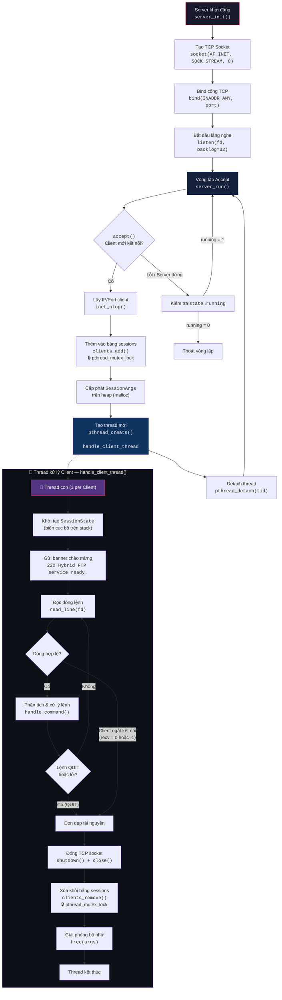
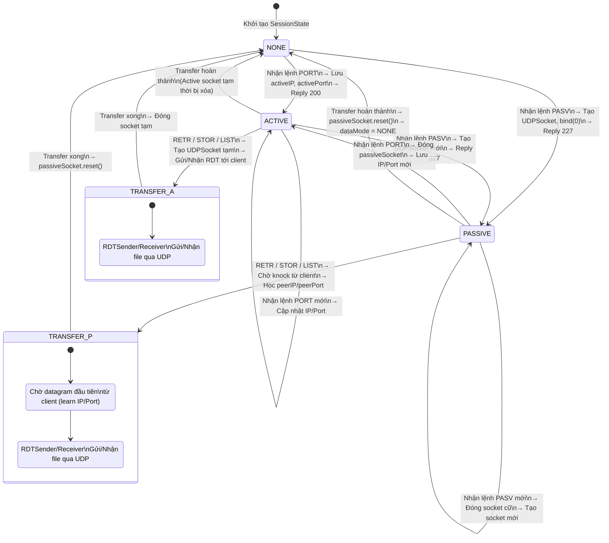
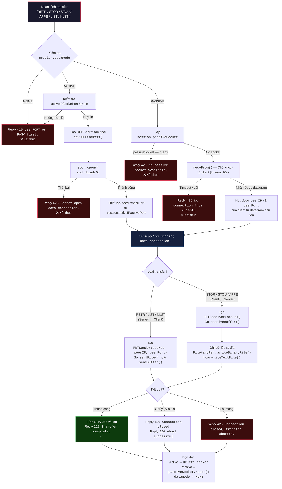
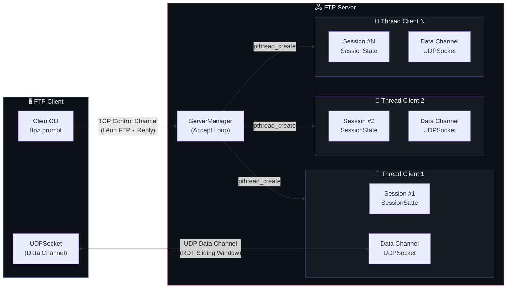

# Section 3.1: Server Thread-Dispatch Logic & Active/Passive Mode Toggle

> **Người phụ trách:** Dev 3  
> **File liên quan:** `src/server/ServerManager.cpp`, `src/server/Session.cpp`, `src/server/Session.h`

---

## 3.1.1 Kiến trúc xử lý đa luồng trên Server (Thread-Dispatch Logic)

### Tổng quan

Hybrid FTP Server sử dụng mô hình **Thread-per-Client** (mỗi client một luồng riêng biệt) dựa trên POSIX Threads (`pthread`). Khi một client kết nối tới, server sinh ra một thread mới chạy hàm `handle_client_thread()` và ngay lập tức `detach` thread đó để quay lại vòng lặp `accept()` phục vụ client tiếp theo.

### Cấu trúc dữ liệu quản lý phiên

```cpp
#define MAX_CLIENTS 100

struct ClientRecord {
    int socketFd;     // File descriptor của TCP socket
    char ip[46];      // Địa chỉ IP client (hỗ trợ cả IPv6)
    int port;         // Port TCP của client
    int active;       // 1 = đang hoạt động, 0 = slot trống
};

struct ServerState {
    int listenFd;                        // Socket lắng nghe TCP
    int port;                            // Port mà server bind
    int running;                         // Cờ trạng thái server (1=chạy, 0=dừng)
    pthread_mutex_t clientsLock;         // Mutex bảo vệ bảng clients
    ClientRecord clients[MAX_CLIENTS];   // Bảng lưu trữ tối đa 100 phiên
};
```

### Lưu đồ xử lý đa luồng (Thread-Dispatch Flowchart)



### Cơ chế bảo vệ dữ liệu chia sẻ (Thread Safety)

| Tài nguyên chia sẻ | Cơ chế bảo vệ | Giải thích |
| :--- | :--- | :--- |
| `ServerState::clients[]` | `pthread_mutex_t clientsLock` | Mutex lock/unlock mỗi khi thêm (`clients_add`) hoặc xóa (`clients_remove`) client khỏi bảng phiên |
| `SessionState` | Biến cục bộ trên stack của thread | Mỗi thread có bản sao `SessionState` riêng → không cần đồng bộ |
| `SessionArgs` | Cấp phát trên heap, 1 owner duy nhất | `malloc()` trong `server_run()`, `free()` trong `handle_client_thread()` → không race condition |
| TCP socket `fd` | Mỗi thread sở hữu riêng 1 fd | `accept()` trả về fd duy nhất cho mỗi kết nối |

### Ưu điểm của mô hình Thread-per-Client

1. **Đơn giản về logic**: Mỗi client được cách ly hoàn toàn trong thread riêng, không cần multiplexing phức tạp (`select`/`poll`/`epoll`).
2. **Blocking I/O tự nhiên**: Các lệnh truyền file (RETR/STOR) có thể block mà không ảnh hưởng client khác.
3. **SessionState cục bộ**: Trạng thái đăng nhập, thư mục làm việc, chế độ truyền đều là biến cục bộ → tránh hoàn toàn xung đột dữ liệu giữa các client.

### Hạn chế và hướng cải tiến

- Số client tối đa bị giới hạn bởi `MAX_CLIENTS = 100` và số thread hệ điều hành cho phép.
- Mỗi thread tiêu tốn ~1–8 MB stack → nếu cần phục vụ hàng nghìn client đồng thời, nên chuyển sang mô hình event-driven (epoll + thread pool).

---

## 3.1.2 Sơ đồ chuyển đổi Active/Passive Mode

### Tổng quan hai chế độ truyền dữ liệu

Hybrid FTP hỗ trợ hai chế độ mở kênh dữ liệu UDP:

| Đặc điểm | Active Mode (PORT) | Passive Mode (PASV) |
| :--- | :--- | :--- |
| **Ai mở socket UDP?** | Server tạo socket mới, gửi tới IP:Port client chỉ định | Server tạo socket mới, bind port ngẫu nhiên, chờ client kết nối tới |
| **Hướng khởi tạo kết nối** | Server → Client | Client → Server |
| **Lệnh FTP** | `PORT h1,h2,h3,h4,p1,p2` | `PASV` |
| **Mã phản hồi** | `200 PORT command successful.` | `227 Entering Passive Mode (h1,h2,h3,h4,p1,p2).` |
| **Phù hợp khi** | Client không nằm sau NAT/firewall | Client nằm sau NAT/firewall (phổ biến hơn) |
| **Số lần sử dụng** | Có thể tái sử dụng cho nhiều transfer | Mỗi lần transfer phải gọi PASV lại (single-use) |

### Trạng thái data channel trong SessionState

```cpp
enum class DataMode { NONE, ACTIVE, PASSIVE };

// Trong struct SessionState:
DataMode dataMode = DataMode::NONE;          // Chế độ hiện tại
std::string activeIP;                        // IP client (Active mode)
uint16_t activePort = 0;                     // UDP port client (Active mode)
std::unique_ptr<UDPSocket> passiveSocket;    // Socket UDP server bind (Passive mode)
```

### Sơ đồ trạng thái chuyển đổi Active/Passive Mode



### Lưu đồ chi tiết: Mở Data Channel cho một lệnh Transfer



### Luồng tương tác Active Mode vs Passive Mode (Sequence Diagram)

```mermaid
sequenceDiagram
    box rgb(13,17,23) Active Mode
    participant CA as FTP Client
    participant SA as FTP Server
    end

    Note over CA,SA: ═══ ACTIVE MODE ═══

    CA->>SA: PORT 192,168,1,10,200,15 (TCP)
    Note right of SA: Lưu activeIP=192.168.1.10<br/>activePort=51215<br/>dataMode=ACTIVE
    SA-->>CA: 200 PORT command successful. (TCP)

    CA->>SA: STOR myfile.bin (TCP)
    SA-->>CA: 150 Opening data connection... (TCP)
    Note right of SA: Server tạo UDPSocket mới<br/>bind(0) → ephemeral port<br/>Gửi/Nhận RDT tới 192.168.1.10:51215

    rect rgb(15,52,96)
        CA->>SA: 📦 RDT DATA packets (UDP)
        SA-->>CA: ✅ RDT ACK packets (UDP)
        CA->>SA: 📦 FIN packet (UDP)
        SA-->>CA: ✅ FINACK (UDP)
    end

    Note right of SA: Ghi file, tính SHA-256<br/>Đóng socket tạm, xóa
    SA-->>CA: 226 Transfer complete. (TCP)

    Note over CA,SA: ═══════════════════════

    box rgb(13,17,23) Passive Mode
    participant CP as FTP Client
    participant SP as FTP Server
    end

    Note over CP,SP: ═══ PASSIVE MODE ═══

    CP->>SP: PASV (TCP)
    Note right of SP: Tạo UDPSocket<br/>bind(0) → port 54321<br/>dataMode=PASSIVE
    SP-->>CP: 227 Entering Passive Mode (127,0,0,1,212,49). (TCP)

    CP->>SP: RETR document.txt (TCP)
    Note left of CP: Client gửi knock<br/>(datagram 15 byte rỗng)

    rect rgb(83,52,131)
        CP->>SP: 🤝 Knock datagram (UDP → port 54321)
        Note right of SP: Học peerIP/peerPort<br/>từ knock datagram
    end

    SP-->>CP: 150 Opening data connection... (TCP)

    rect rgb(15,52,96)
        SP->>CP: 📦 RDT DATA packets (UDP)
        CP-->>SP: ✅ RDT ACK packets (UDP)
        SP->>CP: 📦 FIN packet (UDP)
        CP-->>SP: ✅ FINACK (UDP)
    end

    Note right of SP: Tính SHA-256, log<br/>passiveSocket.reset()<br/>dataMode=NONE
    SP-->>CP: 226 Transfer complete. (TCP)
```



### So sánh luồng xử lý trong code

#### Active Mode — `open_data_channel` lambda (Session.cpp)

```cpp
// Khi dataMode == ACTIVE:
auto *sock = new UDPSocket();     // 1. Tạo socket UDP tạm thời
sock->open();                      // 2. Mở socket
sock->bind(0);                     // 3. Bind port ngẫu nhiên
dataSocket = sock;                 // 4. Trả về cho caller
ownsSocket = true;                 // 5. Caller chịu trách nhiệm delete
peerIP = session.activeIP;         // 6. Đích đến = IP client đã gửi qua PORT
peerPort = session.activePort;     // 7. Port đích = Port client đã gửi qua PORT
```

#### Passive Mode — `open_data_channel` lambda (Session.cpp)

```cpp
// Khi dataMode == PASSIVE:
dataSocket = session.passiveSocket.get();  // 1. Dùng socket đã bind từ lệnh PASV
ownsSocket = false;                         // 2. Session sở hữu socket, không delete
peerIP = "";                                // 3. Chưa biết IP client
peerPort = 0;                               // 4. Chưa biết port client
// → Client phải gửi knock datagram trước, server recvFrom() để học IP/port
```

### Cơ chế dọn dẹp sau transfer

| Chế độ | Sau khi transfer xong | Lý do |
| :--- | :--- | :--- |
| **Active** | `dataSocket->close(); delete dataSocket;` | Socket được tạo mới cho mỗi transfer, cần giải phóng |
| **Passive** | `session.passiveSocket.reset(); session.dataMode = DataMode::NONE;` | Socket passive là single-use theo chuẩn FTP, cần PASV lại cho transfer tiếp theo |

---

## 3.1.3 Tóm tắt kiến trúc tổng thể



**Kết luận:** Kiến trúc đa luồng Thread-per-Client kết hợp với hai chế độ truyền Active/Passive cho phép Hybrid FTP Server phục vụ đồng thời nhiều client, mỗi client có thể chọn chế độ truyền phù hợp với cấu hình mạng của mình. Cơ chế mutex bảo vệ bảng phiên kết nối đảm bảo không xảy ra race condition khi thêm/xóa client.
