# Section 4: Task Assignment Matrix — Bảng phân công công việc

> **Người phụ trách:** Dev 3  
> **Phạm vi:** Giai đoạn 1 đến Giai đoạn 4

---

## 4.1 Bảng phân công tổng quan theo giai đoạn

### Giai đoạn 1: Khởi tạo và Nền tảng (Ngày 1 – 3)

| Ngày | Công việc | Dev 1 | Dev 2 | Dev 3 | File chính |
| :---: | :--- | :---: | :---: | :---: | :--- |
| 1 | Khởi tạo repository Git, cấu trúc thư mục | ✅ | ✅ | ✅ | `CMakeLists.txt`, `.gitignore` |
| 1 | Thống nhất chuẩn code C++ | ✅ | ✅ | ✅ | — |
| 1 | Thiết kế định dạng gói tin TCP | ✅ | | | — |
| 1 | Thiết kế Custom UDP Header (Seq, ACK, Flags) | | ✅ | | `src/rdt/CustomUDPHeader.h` |
| 2–3 | Dựng TCP Server Socket, lắng nghe kết nối | ✅ | | | `src/server/main_server.cpp` |
| 2–3 | Xử lý luồng xác thực cơ bản (USER, PASS, QUIT) | ✅ | | | `src/server/Session.cpp` |
| 2–3 | Dựng UDP Client/Server Socket, gửi nhận gói tin thô | | ✅ | | `src/rdt/UDPSocket.cpp/.h` |
| 2–3 | Đưa Custom UDP Header vào bản tin | | ✅ | | `src/rdt/CustomHeader.cpp` |
| 2–3 | Xây dựng khung giao diện Client CLI | | | ✅ | `src/client/ClientCLI.cpp/.h` |
| 2–3 | Dựng kiến trúc Multi-threading trên Server | | | ✅ | `src/server/ServerManager.cpp/.h` |

### Giai đoạn 2: Xây dựng Core Logic (Ngày 4 – 7)

| Ngày | Công việc | Dev 1 | Dev 2 | Dev 3 | File chính |
| :---: | :--- | :---: | :---: | :---: | :--- |
| 4–5 | Code bộ phân tích cú pháp (CommandParser) | ✅ | | | `src/common/CommandParser.cpp/.h` |
| 4–5 | Logic lệnh thao tác thư mục (PWD, CWD, LIST, MKD, RMD) | ✅ | | | `src/server/Session.cpp` |
| 4–5 | Cài đặt hệ thống mã phản hồi chuẩn 1xx–5xx | ✅ | | | `src/server/Session.cpp` |
| 4–5 | Cài đặt logic Active/Passive mode (PORT, PASV) | | | ✅ | `src/server/Session.cpp` |
| 4–5 | Xây dựng các hàm I/O đọc/ghi file (binary + ASCII) | | | ✅ | `src/common/FileHandler.cpp/.h` |
| 4–5 | Xây dựng PathManager (sandbox thư mục, resolve path) | | | ✅ | `src/common/PathManager.cpp/.h` |
| 6–7 | Lập trình cơ chế RDT: Timeout, Retransmit, ACK | | ✅ | | `src/rdt/ReliableTransfer.cpp/.h` |
| 6–7 | Mô hình Stop-and-Wait (sendPacket/receivePacket) | | ✅ | | `src/rdt/ReliableTransfer.cpp` |
| 6–7 | Hỗ trợ Dev 2 debug mạng | ✅ | | ✅ | — |
| 6–7 | Tích hợp hàm băm SHA-256 (CryptoHash) | | | ✅ | `src/common/CryptoHash.cpp/.h` |

### Giai đoạn 3: Tích hợp hệ thống & Kiểm thử (Ngày 8 – 10)

| Ngày | Công việc | Dev 1 | Dev 2 | Dev 3 | File chính |
| :---: | :--- | :---: | :---: | :---: | :--- |
| 8 | Cài đặt lệnh TYPE {A\|I}, MODE {S} | ✅ | | | `src/server/Session.cpp` |
| 8 | Implement lệnh RETR (điều phối trên Control Channel) | ✅ | | | `src/server/Session.cpp` |
| 8 | Implement lệnh STOR (điều phối trên Control Channel) | ✅ | | | `src/server/Session.cpp` |
| 8 | API chia file thành chunks + sendFile() | | ✅ | | `src/rdt/ReliableTransfer.cpp` |
| 8 | API nhận nhiều gói liên tiếp + receiveFile() | | ✅ | | `src/rdt/ReliableTransfer.cpp` |
| 8 | FLAG_FIN cho gói cuối cùng | | ✅ | | `src/rdt/CustomUDPHeader.h` |
| 8 | Viết hàm mở UDP data channel (Active/Passive) | | | ✅ | `src/server/Session.cpp` |
| 8 | Viết sendFileOverDataChannel() | | | ✅ | `src/server/Session.cpp` |
| 8 | Viết receiveFileOverDataChannel() | | | ✅ | `src/server/Session.cpp` |
| 8 | Tự động tính hash sau RETR/STOR và log | | | ✅ | `src/server/Session.cpp` |
| 8 | Test end-to-end: USER→PASS→TYPE→PASV→STOR→HASH→RETR | | | ✅ | `src/common/test_dev3.sh` |
| 9 | Sliding Window / Go-Back-N (RDTWindowSender) | | ✅ | | `src/rdt/SlidingWindow.cpp/.h` |
| 9 | Flow Control (Advertised Window) | | ✅ | | `src/rdt/SlidingWindow.cpp` |
| 9 | Congestion Control (Slow Start + AIMD) | | ✅ | | `src/rdt/SlidingWindow.cpp` |
| 9 | Implement ABOR (hủy transfer giữa chừng) | ✅ | | ✅ | `src/server/Session.cpp` |
| 9 | Implement STOU (upload tên file duy nhất) | | | ✅ | `src/server/Session.cpp`, `PathManager.cpp` |
| 9 | Implement APPE (ghi nối file) | | | ✅ | `src/server/Session.cpp`, `FileHandler.cpp` |
| 9 | Xử lý client ngắt kết nối đột ngột | ✅ | | ✅ | `src/server/Session.cpp` |
| 10 | Code Freeze — chỉ sửa lỗi | ✅ | ✅ | ✅ | Toàn bộ repo |
| 10 | Build sạch trên clean machine | ✅ | ✅ | ✅ | `CMakeLists.txt` |
| 10 | Test nhiều client đồng thời | | | ✅ | `src/server/ServerManager.cpp` |
| 10 | Test file ASCII (.txt) và Binary qua RETR/STOR | | | ✅ | `test_dev3.sh` |
| 10 | Chụp ảnh demo evidence | | | ✅ | `docs/` |

### Giai đoạn 4: Tài liệu hóa & Luyện tập bảo vệ (Ngày 11 – 12)

| Ngày | Công việc | Dev 1 | Dev 2 | Dev 3 | File chính |
| :---: | :--- | :---: | :---: | :---: | :--- |
| 11 | Section 1: Sequence Diagram vòng đời TCP + UDP | ✅ | | | `docs/` |
| 11 | Section 2.1: TCP Control Packet Format, mã phản hồi | ✅ | | | `docs/` |
| 11 | Section 2.2: UDP Custom Header Fields | | ✅ | | `docs/` |
| 11 | Section 3.2: RDT Sender/Receiver State Machines | | ✅ | | `docs/` |
| 11 | Section 3.1: Thread-Dispatch Logic & Active/Passive Mode | | | ✅ | `docs/` |
| 11 | Section 4: Task Assignment Matrix | | | ✅ | `docs/` |
| 11 | Section 5: Self-Assessment & Peer Evaluation | ✅ | | | `docs/` |
| 11 | Section 6: GenAI Usage & Code Refinement Log | | ✅ | | `docs/GenAI_Log.md` |
| 11 | Section 7: Application Demo Evidence | | | ✅ | `docs/` |
| 12 | Diễn tập vấn đáp chéo (Oral Defense Prep) | ✅ | ✅ | ✅ | — |
| 12 | Mô phỏng Live Coding / Debugging | ✅ | ✅ | ✅ | — |

---

## 4.2 Ma trận phân công theo Module/File

| Module / File | Người phát triển chính | Người hỗ trợ / Review | Vai trò |
| :--- | :---: | :---: | :--- |
| **`src/server/Session.cpp/.h`** | Dev 1, Dev 3 | Dev 2 | Dev 1: Control commands + RETR/STOR logic; Dev 3: Data channel, HASH, STOU, APPE |
| **`src/server/ServerManager.cpp/.h`** | Dev 3 | Dev 1 | Quản lý vòng lặp accept, bảng phiên, multi-threading |
| **`src/server/main_server.cpp`** | Dev 1 | — | Entry point FTP server |
| **`src/client/ClientCLI.cpp/.h`** | Dev 3 | Dev 1 | Giao diện CLI, xử lý lệnh phía client, data transfer logic |
| **`src/client/main_client.cpp`** | Dev 3 | — | Entry point FTP client |
| **`src/common/CommandParser.cpp/.h`** | Dev 1 | — | Phân tích cú pháp lệnh FTP |
| **`src/common/PathManager.cpp/.h`** | Dev 3 | Dev 1 | Quản lý đường dẫn, sandbox, STOU unique filename |
| **`src/common/FileHandler.cpp/.h`** | Dev 3 | — | Đọc/ghi file binary và ASCII, chế độ append |
| **`src/common/CryptoHash.cpp/.h`** | Dev 3 | — | Tính mã băm SHA-256 cho kiểm tra toàn vẹn file |
| **`src/rdt/CustomUDPHeader.h`** | Dev 2 | — | Định nghĩa cấu trúc header UDP tự chế (15 bytes) |
| **`src/rdt/CustomHeader.cpp`** | Dev 2 | — | Serialize/deserialize header, checksum |
| **`src/rdt/UDPSocket.cpp/.h`** | Dev 2 | — | Lớp bọc UDP socket gửi/nhận |
| **`src/rdt/ReliableTransfer.cpp/.h`** | Dev 2 | Dev 3 | API truyền tin cậy: sendFile, sendBuffer, receiveFile, receiveBuffer |
| **`src/rdt/SlidingWindow.cpp/.h`** | Dev 2 | — | Go-Back-N Sliding Window + Flow/Congestion Control (AIMD) |
| **`src/rdt/FileTransferClient.cpp`** | Dev 2 | — | Client test truyền file bằng RDT |
| **`src/rdt/FileTransferServer.cpp`** | Dev 2 | — | Server test nhận file bằng RDT |
| **`test_rdt.sh`** | Dev 2 | Dev 3 | Script nghiệm thu tự động RDT |
| **`src/common/test_dev3.sh`** | Dev 3 | — | Script test riêng cho Dev 3 (E2E) |
| **`CMakeLists.txt`** | Cả nhóm | — | Cấu hình biên dịch CMake |

---

## 4.3 Biểu đồ Gantt phân công công việc

```mermaid
gantt
    title Hybrid FTP — Phân công công việc theo thời gian
    dateFormat  X
    axisFormat Day %s

    section Dev 1 — TCP Control
    Setup TCP Server Socket           :d1_1, 2, 3
    Xác thực USER/PASS/QUIT           :d1_2, 2, 3
    CommandParser + lệnh thư mục      :d1_3, 4, 5
    Mã phản hồi 1xx-5xx               :d1_4, 4, 5
    Hỗ trợ debug RDT                  :d1_5, 6, 7
    TYPE/MODE + RETR/STOR             :d1_6, 8, 8
    ABOR + edge cases                 :d1_7, 9, 9
    Bug fixing                        :d1_8, 10, 10
    Viết Section 1, 2.1, 5            :d1_9, 11, 11
    Diễn tập vấn đáp                  :d1_10, 12, 12

    section Dev 2 — RDT/UDP
    Custom UDP Header                 :d2_1, 1, 1
    UDP Socket gửi/nhận               :d2_2, 2, 3
    RDT Stop-and-Wait                 :d2_3, 6, 7
    sendFile/receiveFile API           :d2_4, 8, 8
    Sliding Window + AIMD             :d2_5, 9, 9
    Bug fixing                        :d2_6, 10, 10
    Viết Section 2.2, 3.2, 6         :d2_7, 11, 11
    Diễn tập vấn đáp                  :d2_8, 12, 12

    section Dev 3 — File I/O & Concurrency
    Client CLI + Multi-threading      :d3_1, 2, 3
    Active/Passive mode               :d3_2, 4, 5
    FileHandler + PathManager         :d3_3, 4, 5
    CryptoHash SHA-256                :d3_4, 6, 7
    Data channel + E2E test           :d3_5, 8, 8
    STOU/APPE + edge cases            :d3_6, 9, 9
    Bug fixing + Demo evidence        :d3_7, 10, 10
    Viết Section 3.1, 4, 7           :d3_8, 11, 11
    Diễn tập vấn đáp                  :d3_9, 12, 12
```

---

## 4.4 Thống kê đóng góp theo dòng code (ước tính)

| Thành viên | Số file chính phụ trách | Module chính | Đóng góp ước tính |
| :--- | :---: | :--- | :---: |
| **Dev 1** | 4 | TCP Control, CommandParser, Session (control flow) | ~33% |
| **Dev 2** | 7 | RDT, UDP Socket, Sliding Window, Congestion Control | ~34% |
| **Dev 3** | 8 | Client CLI, ServerManager, FileHandler, PathManager, CryptoHash, Data Channel, Test Scripts | ~33% |

> **Ghi chú:** Tỷ lệ đóng góp được tính dựa trên khối lượng code, mức độ phức tạp, và vai trò kiểm thử. Mọi thành viên đều tham gia code review và hỗ trợ debug lẫn nhau.
